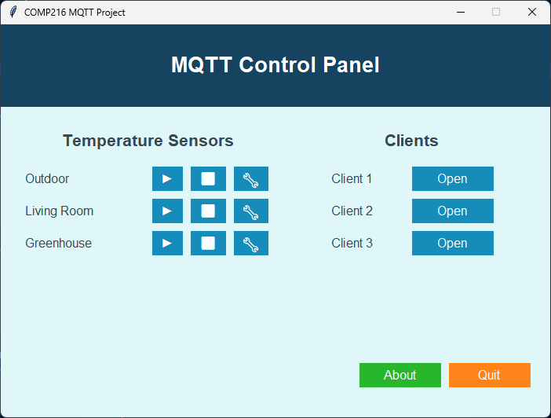
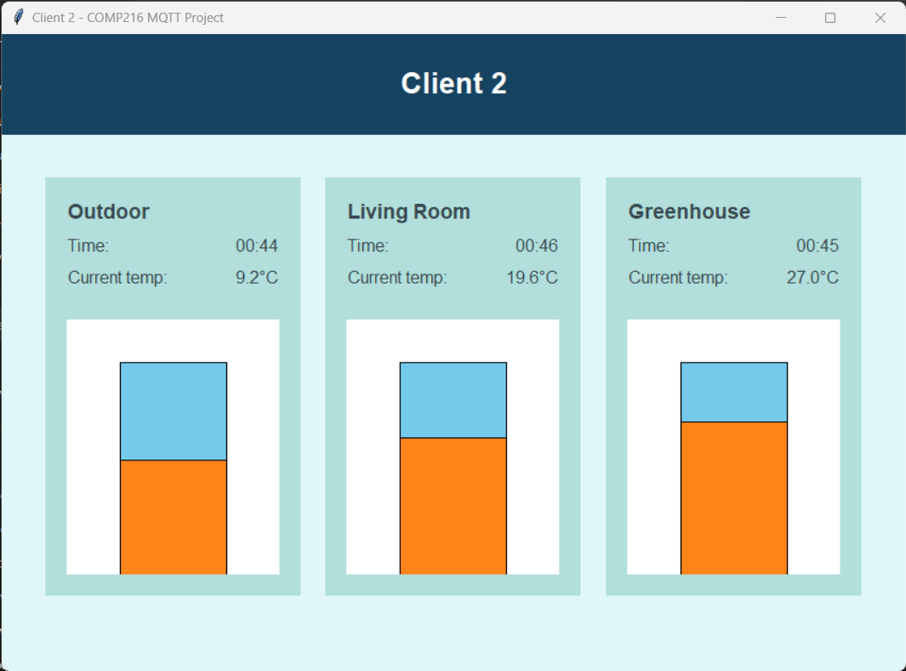
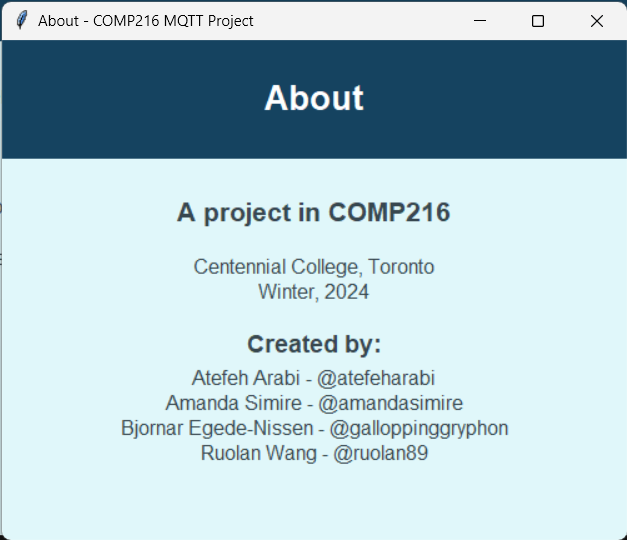

# MQTT Internet of Things Simulator

Project in COMP216, Centennial College, 2024.

Python program that simulates IoT devices and client applications using the MQTT protocol and tkinter.

[Click here to view the assignment (Word doc)](./Week_14_Final_project.docx).

**Collaborators:**
- [@amandasimire](https://github.com/amandasimire)
- [@atefeharabi](https://github.com/atefeharabi)
- [@ruolan89](https://github.com/ruolan89)
- [@galloppinggryphon](https://github.com/galloppinggryphon)


## Screenshots







## Requirements

- **Minimum Python version: 3.12**
- Recent version of VSCode, with the Python extension


## Getting started with this repo

1.  Clone this repo: `git clone https://github.com/galloppinggryphon/comp216_mqtt.git`
2.  Open the `comp216_mqtt` folder
3.  Create a virtualenv: `python -m venv .venv`
4.  Install dependencies (Paho MQTT client):  `pip install -r requirements.txt`
5.  Install Eclipse Mosquitto broker: [https://mosquitto.org/](https://mosquitto.org/)

⚠️ NOT COMPATIBLE WITH THE **CODE RUNNER EXTENSION** FOR VSCODE ⚠️

If you have Code Runner installed, it **must** be disabled for this project.

## Development aids for VSCode

**Extensions**:

- Pylance
- autopep8 (code formatter): [https://marketplace.visualstudio.com/items?itemName=ms-python.autopep8](https://marketplace.visualstudio.com/items?itemName=ms-python.autopep8)
- isort (import assistance): [https://marketplace.visualstudio.com/items?itemName=ms-python.isort](https://marketplace.visualstudio.com/items?itemName=ms-python.isort)

Enable the formatter and isort in `.vscode/settings.json` (user or workspace) like this:

```
"[python]": {
    // (OPTIONAL) "editor.formatOnType": true,
    "editor.defaultFormatter": "ms-python.autopep8"
},
"python.analysis.autoImportCompletions": true
```

## Running

1.  Make sure mosquitto is running: `mosquitto` or `mosquitto -v` (verbose)
2.  Run `python main.py` in the `app` folder

# Package structure

The project is organzied as implicit (anonymous/folder based) packages.

### Package structure:

```
app/
    api/
        helpers/
    config/
        device_data/
    gui/
        clients/
        framework/
        	components/
    helpers/
```

---

## Classes


### Main API classes

<table><tbody><tr><td>Class name</td><td>Parent&nbsp;</td><td>Notes</td></tr><tr><td>MQTTClient</td><td>&nbsp;</td><td>Base class for connecting to MQTT broker with paho.mqtt.client</td></tr><tr><td>MQTTPublisher</td><td>MQTTClient</td><td>Publish messages to MQTT broker</td></tr><tr><td>MQTTSubscriber</td><td>MQTTClient</td><td>Subscribe to messages from MQTT broker</td></tr><tr><td>IoTSimulator</td><td>ThreadsafeSingletonMeta</td><td>Singleton. Handles creating and running publishers and subscribers</td></tr><tr><td>IoTDeviceConfig</td><td>&nbsp;</td><td>Dataclass for holding information about each IoT device</td></tr><tr><td>PayloadSimulator</td><td>&nbsp;</td><td>Create payload for publisher. Simulate sporadic errors. Used by IoTDeviceConfig</td></tr><tr><td>DataGenerator</td><td>&nbsp;</td><td>Generate random data for PayloadSimulator</td></tr></tbody></table>

---

### Broker


\---
